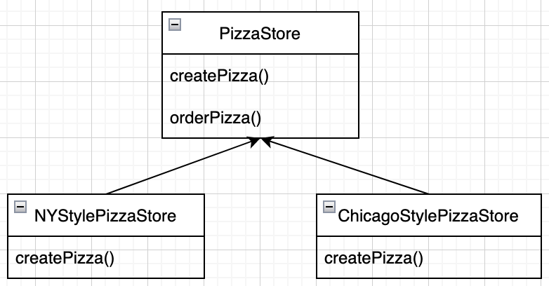

# 4. 객체지향 빵 굽기 - 팩토리 패턴

- 느슨한 결합으로 객체지향 디자인을 만들어 봅시다
  - 객체의 인스턴스를 만드는 작업이 항상 공개되어야 하는 것은 아니며,
  - 오히려 모든 것을 공객했다가는 결합 문제가 생길 수 있다는 사실을 배웁니다
- 팩토리 패턴으로 불필요한 의존성을 없애서 결합 문제를 해결하는 방법을 알아봅시다

- `new` 연산자가 눈에 띈다면 `구상`이라는 용어를 떠올려 주세요
  - new를 사용하면 구상 클래스의 인스턴스가 만들어집니다
  - 인터페이스가 아닌 특정 구현을 사용하는 것
  - 구상 클래스를 바탕으로 코딩하면 나중에 코드를 수정해야 할 가능성이 커지고, 유연성이 떨어진다

```ts
const duck: Duck = new MallardDuck();
```

- Duck 이란 인터페이스를 써서 코드를 유연하게 만들려고 합니다

- 열련의 구상 클래스가 있다면 어쩔 수 없이 다음과 같은 코드를 만들어야 합니다

```ts
let duck: Duck;
if (picnic) {
  duck = new MallardDuck();
} else if (hunting) {
  duck = new DecoyDuck();
} else if (inBathTub) {
  duck = new RubberDuck();
}
```

- 구상 클래스의 인스턴스가 여러 개 있으며,
- 그 인스턴스의 형식은 실행 시에 주어진 조건에 따라 결정됨
- 이런 코드를 변경하거나 확장해야 할 때는 코드를 다시 확인하고 새로운 코드를 추가하거나 기존 코드를 제거해야 함

  - 관리와 갱신이 어려워지고 오류가 생길 가능성도 커짐

- 인터페이스에 맞춰서 코딩하면 시스템에서 일어날 수 있는 변화에 대응할 수 있다
  - 인터페이스를 바탕으로 만들어진 코드는 어떤 클래스든 특정 인터페이스만 구현하면 사용할 수 있기 때문
- 반대로 구상클래스를 사용하면 새로운 구상 클래스가 추가될 때마다 코드를 고쳐야 하므로 수많은 문제가 생길 수 있다

- 즉, 변경에 닫혀 있는 코드가 된다
- 새로운 구상형식을 써서 확장해야 할 때는 어떻게 해서든 다시 열 수 있게 만들어야 한다

  - OCP, 확장에는 열려있고 변경에는 닫혀 있어야 한다

- 첫 번째 디자인 원칙, 바뀌는 부분을 찾아내서 바뀌지 않는 부분과 분리해야 한다
- 어떻게 하면 애플리케이션에서 구상 클래스의 인스턴스 생성 부분을 전부 찾아내서 애플리케이션의 나머지 부분으로부터 분리(캡슐화)할 수 있을까요?

## 최첨단 피자 코드 만들기

```ts
class Pizza {
  prepare() {
    console.log("Preparing " + this.name);
    console.log("Tossing dough...");
    console.log("Adding sauce...");
    console.log("Adding toppings: ");
    for (let i = 0; i < this.toppings.length; i++) {
      console.log(" " + this.toppings[i]);
    }
  }
  bake() {
    console.log("Bake for 25 minutes at 350");
  }
  cut() {
    console.log("Cutting the pizza into diagonal slices");
  }
  box() {
    console.log("Place pizza in official PizzaStore box");
  }
  getName() {
    return this.name;
  }
}

const oderPizza = () => {
  const pizza = new Pizza();
  pizza.prepare();
  pizza.bake();
  pizza.cut();
  pizza.box();
  return pizza;
};
```

- 피자 종류가 하나만 있는건 아니죠?
- 올바른 피자 종류를 고르고 그에 맞게 피자를 만드는 코드를 추가해보자

```ts
const oderPizza = (type) => {
  let pizza;
  if (type === "cheese") {
    pizza = new CheesePizza();
  } else if (type === "pepperoni") {
    pizza = new PepperoniPizza();
  } else if (type === "greek") {
    pizza = new GreekPizza();
  }
  pizza.prepare();
  pizza.bake();
  pizza.cut();
  pizza.box();
  return pizza;
};
```

## 피자 코드 추가하기

- 피자 종류가 늘어나면 if문도 늘어난다

```ts
const oderPizza = (type: string) => {
  let pizza: Pizza;
  if (type === "cheese") {
    pizza = new CheesePizza();
  } else if (type === "pepperoni") {
    pizza = new PepperoniPizza();
  } else if (type === "clam") {
    pizza = new ClamPizza();
  } else if (type === "veggie") {
    pizza = new VeggiePizza();
  }
  pizza.prepare();
  pizza.bake();
  pizza.cut();
  pizza.box();
  return pizza;
};
```

- 피자 종류가 바뀔 때 마다 코드를 계속 고쳐야 함

## 객체 생성 부분 캡슐화하기

- oderPizza() 메소드에서 생성 코드를 빼내서 캡슐화하자
  - 팩토리(Factory)

## 객체 생성 팩토리 만들기

```ts
class SimplePizzaFactory {
  createPizza(type: string): Pizza {
    let pizza: Pizza;
    if (type === "cheese") {
      pizza = new CheesePizza();
    } else if (type === "pepperoni") {
      pizza = new PepperoniPizza();
    } else if (type === "clam") {
      pizza = new ClamPizza();
    } else if (type === "veggie") {
      pizza = new VeggiePizza();
    }
    return pizza;
  }
}
```

## 무엇이든 물어보세요

- 캡슐화하면 무슨 장점이 있는 건가요?

  - orderPizza() 메소드 뿐만 아니라
    피자 객체를 받아서 피자를 설명하거나 가격을 알려주는 PizzaShopMenu 클래스와
    HomeDelivery 클래스에서도 사용할 수 있다
  - 팩토리 클래스로 캡슐화해 놓으면 팩토리 클래스 하나만 고치면 된다

- 팩토리 정적 메소드로 선언한 디자인이랑은 어떻게 다른건가요?
  - 간단한 팩토리를 정적 메소드로 정의하는 기법도 많이 쓰입니다(정적 팩토리)
  - 하지만 정적 메소드를 쓰면 서브클래스를 만들어서 객체 생성 메소드의 행동을 변경할 수 없다는 단점이 있다

## 클라이언트 코드 수정하기

- 팩토리로 피자 객체를 생성하도록 고쳐보자

```ts
class PizzaStore {
  private factory: SimplePizzaFactory;
  constructor(factory: SimplePizzaFactory) {
    this.factory = factory;
  }
  orderPizza(type: string): Pizza {
    const pizza = this.factory.createPizza(type);
    pizza.prepare();
    pizza.bake();
    pizza.cut();
    pizza.box();
    return pizza;
  }
}
```

## '간단한 팩토리'의 정의

## 다양한 팩토리 만들기

- 각 지점마다 그 지역의 특성과 입맛을 반영한 다양한 스타일의 피자를 만들어야 합니다
  - 뉴욕 스타일
  - 시카고 스타일
  - 캘리포니아 스타일

```ts
const nyFactory = new NYPizzaFactory();
nyStore = new PizzaStore(nyFactory);
nyStore.orderPizza("cheese");

const chicagoFactory = new ChicagoPizzaFactory();
chicagoStore = new PizzaStore(chicagoFactory);
chicagoStore.orderPizza("cheese");
```

- 지점을 조금 더 제대로 관리해봅시다
  - 지점에서 만든 팩토리로 피자를 만들긴 하지만
  - 굽는 방식이 달라지거나 피자를 자르는 것을 까먹는 등의 일이 생기기 시작
- 이런 문제를 해결하려면 PizzaStore와 피자 제작 코드 전체를 하나로 묶어주는 프레임워크를 만들어야 합니다

## 피자 가게 프레임워크 만들기

- 공통 팩토리 : oderPizza(type: string) 메소드 -> 내부적으로 createPizza(type) 메서드를 사용
- 각 지점별 팩토리 : abstract createPizza(type: string) 추상 메소드
  - 여기에서 type에 string을 제한해야되지 않을까 -> enum, union type

```ts
abstract class PizzaStore {
  abstract createPizza(type: string): Pizza;
  orderPizza(type: string): Pizza {
    const pizza = this.createPizza(type);
    pizza.prepare();
    pizza.bake();
    pizza.cut();
    pizza.box();
    return pizza;
  }
}
```

- 피자를 만드는 일 자체는 전부 PizzaStore 클래스에 진행하면서도 지점의 스타일을 살릴 수 있는 방법
  - createPizza() 메소드를 PizzaStore에 다시 넣고
  - createPizza() 메소드를 추상 메소드로 만들어서 서브클래스에서 구현하도록 만들면 됩니다

## 서브클래스가 결정하는 것 알아보기



- PizzaStore의 orderPizza 메소드에 이미 주문 시스템이 잘 갖춰져 있습니다
- 모든 지점에서 이 주문 시스템을 따라 주문이 진행되어야 합니다

- 피자의 종류는 어떤 서브클래스를 선택했느냐에 따라 결정됩니다
- oderPizza() 메소드는 서브클래스에서 무슨 일이 일어나는지 알지 못하며 그저 완성된 피자를 받아서 주문을 처리하므로
  orderPizza()가 보기에는 피자 종류를 서브클래스에서 결정해서 전달해 주는 것 같다

## 피자 스타일 서브클래스 만들기

```ts
class NYPizzaStore extends PizzaStore {
  createPizza(type: string): Pizza {
    if (type === "cheese") {
      return new NYStyleCheesePizza();
    } else if (type === "veggie") {
      return new NYStyleVeggiePizza();
    } else if (type === "clam") {
      return new NYStyleClamPizza();
    } else if (type === "pepperoni") {
      return new NYStylePepperoniPizza();
    } else return null;
  }
}

class ChicagoPizzaStore extends PizzaStore {
  createPizza(type: string): Pizza {
    if (type === "cheese") {
      return new ChicagoStyleCheesePizza();
    } else if (type === "veggie") {
      return new ChicagoStyleVeggiePizza();
    } else if (type === "clam") {
      return new ChicagoStyleClamPizza();
    } else if (type === "pepperoni") {
      return new ChicagoStylePepperoniPizza();
    } else return null;
  }
}
```

## 팩토리 메소드 선언하기

## 피자 팩토리 메소드로 피자 주문하기

## 피자가 만들어지기까지

- PizzaStore 인스턴스 확보
  - 조엘 : ChicagoPizzaStore 인스턴스
  - 에단 : NYPizzaStore 인스턴스
- 각 PizzaStore 인스턴스에서 oderPizza를 호출
  - 이때 oderPizza의 파라미터로 메뉴를 알려줘야 함(치즈피자, 야채피자 등)
- oderPizza에선 createPizza메소드가 호출 됨
  - createPizza메소드는 PizzaStore 인스턴스(ChicagoPizzaStore, NYPizzaStore)에 정의되어 있음

```ts
// 1. 에단이 주문한 내역을 따라가 봅시다 우선 NYPizzaStore가 필요합니다
const nyPizzaStore = new NYPizzaStore();

// 2. 피자 가게가 확보됐으니 이제 주문을 받을 수 있습니다
nyPizzaStore.orderPizza("cheese");

// 3. orderPizza() 메소드에서 createPizza() 메소드를 호출합니다
const pizza = createPizza("cheese");

// 4. 아직 준비가 되지 않은 피자를 받았습니다 이제 만드는 작업을 마무리해야겠죠
pizza.prepare();
pizza.bake();
pizza.cut();
pizza.box();
```

## Pizza 클래스 만들기

```ts
abstract class Pizza {
  name: string;
  dough: string;
  sauce: string;
  toppings: string[] = [];

  prepare(): void {
    console.log(`Preparing ${this.name}`);
    console.log("Tossing dough...");
    console.log("Adding sauce...");
    console.log("Adding toppings: ");
    for (let i = 0; i < this.toppings.length; i++) {
      console.log(`  ${this.toppings[i]}`);
    }
  }

  bake(): void {
    console.log("Bake for 25 minutes at 350");
  }

  cut(): void {
    console.log("Cutting the pizza into diagonal slices");
  }

  box(): void {
    console.log("Place pizza in official PizzaStore box");
  }

  getName(): string {
    return this.name;
  }
}
```

- 피자 구상 서브 클래스
  - 뉴욕 스타일 치즈 피자
  - 시카고 스타일 치즈 피자

```ts
class NYStyleCheesePizza extends Pizza {
  constructor() {
    super();
    this.name = "NY Style Sauce and Cheese Pizza";
    this.dough = "Thin Crust Dough";
    this.sauce = "Marinara Sauce";

    this.toppings.push("Grated Reggiano Cheese");
  }
}

class ChicagoStyleCheesePizza extends Pizza {
  constructor() {
    super();
    this.name = "Chicago Style Deep Dish Cheese Pizza";
    this.dough = "Extra Thick Crust Dough";
    this.sauce = "Plum Tomato Sauce";

    this.toppings.push("Shredded Mozzarella Cheese");
  }

  cut(): void {
    console.log("Cutting the pizza into square slices");
  }
}
```

## 최첨단 피자 코드 테스트

- 피자를 만들어보자

```ts
const nyStore = new NYPizzaStore();
const chicagoStore = new ChicagoPizzaStore();

const pizza = nyStore.orderPizza("cheese");
console.log(`Ethan ordered a ${pizza.getName()}`);

const pizza2 = chicagoStore.orderPizza("cheese");
console.log(`Joel ordered a ${pizza2.getName()}`);
```

## 팩토리 메소드 패턴 살펴보기

- 모든 팩토리 패턴은 객체 생성을 캡슐화합니다

### 생산자(Creator) 클래스 캡슐화

```ts
// 생산자(Creator) 클래스
abstract class PizzaStore {
  abstract createPizza(type: string): Pizza;
  orderPizza(type: string): Pizza {
    const pizza = this.createPizza(type);
    pizza.prepare();
    pizza.bake();
    pizza.cut();
    pizza.box();
    return pizza;
  }
}

// 구상 생산자(Concrete Creator) 클래스
class NYPizzaStore extends PizzaStore {
  createPizza(type: string): Pizza {
    if (type === "cheese") {
      return new NYStyleCheesePizza();
    } else if (type === "veggie") {
      return new NYStyleVeggiePizza();
    } else if (type === "clam") {
      return new NYStyleClamPizza();
    } else if (type === "pepperoni") {
      return new NYStylePepperoniPizza();
    } else return null;
  }
}

class ChicagoPizzaStore extends PizzaStore {
  createPizza(type: string): Pizza {
    if (type === "cheese") {
      return new ChicagoStyleCheesePizza();
    } else if (type === "veggie") {
      return new ChicagoStyleVeggiePizza();
    } else if (type === "clam") {
      return new ChicagoStyleClamPizza();
    } else if (type === "pepperoni") {
      return new ChicagoStylePepperoniPizza();
    } else return null;
  }
}
```

### 피자(Pizza) 클래스 캡슐화

```ts
abstract class Pizza {
  name: string;
  dough: string;
  sauce: string;
  toppings: string[] = [];

  prepare(): void {
    console.log(`Preparing ${this.name}`);
    console.log("Tossing dough...");
    console.log("Adding sauce...");
    console.log("Adding toppings: ");
    for (let i = 0; i < this.toppings.length; i++) {
      console.log(`  ${this.toppings[i]}`);
    }
  }

  bake(): void {
    console.log("Bake for 25 minutes at 350");
  }

  cut(): void {
    console.log("Cutting the pizza into diagonal slices");
  }

  box(): void {
    console.log("Place pizza in official PizzaStore box");
  }

  getName(): string {
    return this.name;
  }
}

class NYStyleCheesePizza extends Pizza {
  constructor() {
    super();
    this.name = "NY Style Sauce and Cheese Pizza";
    this.dough = "Thin Crust Dough";
    this.sauce = "Marinara Sauce";

    this.toppings.push("Grated Reggiano Cheese");
  }
}
```

## 병렬 클래스 계층구조 알아보기

- Pizza와 PizzaStore 둘다 추상 클래스로 시작하고
  - 그 클래스를 확장하는 구상 클래스들을 가지고 있습니다

## 디자인 퍼즐

- 캘리포니아 피자도 추가해보자(생략)

## 팩토리 메소드 패턴 정의

- 팩토리 메소드 패턴(Factory Method Pattern)은 객체 생성할 때 필요한 인터페이스를 만듭니다

  - 어떤 클래스의 인스턴스를 만들지는 서브클래스에서 결정합니다
  - 팩토리 메소드 패턴을 사용하면 클래스 인스턴스 만드는 일을 서브클래스에게 맡기게 됩니다

- 다른 팩토리를 쓸 때와 마찬가지로 팩토리 메소드 패턴으로 구상 형식 인스턴스를 만드는 작업을 캡슐화 할 수 있습니다

  - 프레임워크화(orderPizza 메소드는 피자 종류에 상관 없이 동일하게 작동합니다)

- 사용하는 서브 클래스에 따라 생산되는 객체 인스턴스가 결정됩니다
  - NYStylePizzaStore는 NYStylePizza를 만들고
  - ChicagoStylePizzaStore는 ChicagoStylePizza를 만듭니다
  - 각 지점마다 제공되는 피자가 다름

## 무엇이든 물어보세요

- 구상 생산자 클래스가 하나 밖에 없다면 팩토리 메소드 패턴을 쓸 필요가 있나요?

  - 구상 생산자 클래스가 하나밖에 없더라도 팩토리 메소드 패턴은 충분히 유용합니다
  - 제품을 생산하는 부분과 사용하는 부분을 분리할 수 있으니까요
  - 다른 제품을 추가하거나 제품 구성을 변경하더라도 Creator 클래스가 ConcreteProduct와 느슨하게 결합되어 있으므로
    Creator는 건드릴 필요가 없다

- 뉴욕 시카고 지점을 만들 때는 간단한 팩토리를 사용한 것 같아요

  - 간단한 팩토리와 비슷하지만 조금 다른 방법을 사용
    - PizzaStore의 각 구상 클래스를 구현해 놓은 코드를 보면
    - 앞에서 봤던 SimplePizzaFactory(하나의 클래스에서 분기처리해서 타입에 따라 다른 피자 제공)와 상당히 비슷해보이지만
    - 구상 클래스를 만들 때 createPizza() 추상 메소드가 정의되어 있는 추상 클래스를 확장해서 만들었습니다
    - createPizza() 메소드에서 어떤 일을 할지는 각 지점에서 결정합니다
    - 간단한 팩토리(SimplePizzaFactory)를 사용할 때는 팩토리가 PizzaStore안에 포함되었다

- 팩토리 메소드와 생산자 클래스는 추상으로 선언해야 하나요?

  - 꼭 그래야하는건 아닙니다
  - 몇몇 간단한 구상 제품은 기본 팩토리 메소드를 정의해서 Creator의 서브클래스 없이 만들 수 있습니다

- 모든 구상 생산자 클래스에서 여러 개의 제품을 만들어야 하나요?
  아니면 그 중에 한두 개만 만들어도 되나요?

  - 앞에서는 매개 변수 팩토리 메소드(parameterized factory method)를 사용했습니다
  - 전달받은 매개변수를 바탕으로 한 가지 이상의 객체를 만들 수 있죠
  - 하지만 팩토리에서 매개변수를 쓰지 않고 그냥 `한 가지 객체만 만드는 경우도` 많습니다
  - 어떤 방법을 쓰든지 팩토리 메소드 패턴을 사용한다는 데는 변함이 없죠

- 근데 매개변수 팩토리 메소드를 사용하면 형식 안전성(type-safety)에 지장이 있지 않나요?

  - 매개변수 형식을 나타내는 객체를 만들 수도 있고, 정적 상수, enum을 사용할 수도 있습니다
  - 나) TS에선 union type을 사용하면 될 것 같다

- 간단한 팩토리와 팩토리 메소드 패턴의 차이를 아직 잘 모르겠어요
  팩토리 메소드 패턴에서 피자를 리턴하는 클래스가 서브 클래스라는 점을 빼면 거의 같잖아요
  좀 더 자세히 설명해 주실 수 있나요?
  - 팩토리 메소드 패턴과 간단한 팩토리는 상당히 비슷합니다
  - 하지만 간단한 팩토리는 일회용 처방에 불과한 반면, 팩토리 메소드 패턴을 사용하면 여러 번 재사용이 가능한 프레임워크를 만들 수 있습니다
  - 예를들어, 팩토리 메소드 패턴의 orderPizza() 메소드는 일반적인 프레임워크를 제공합니다
  - 간단한 팩토리는 객체 생성을 캡슐화하는 방법을 사용하긴 하지만 팩토리 메소드만큼 유연하지는 않습니다

## 스승과 제자

- 바뀌는 부분을 캡슐화하라
- 객체 생성하는 코드를 캡슐화 할 수 있따
  - 구상 클래스의 인스턴스를 만드는 코드를 캡슐화 -> 팩토리
- 팩토리의 장점?

  - 객체 생성 코드를 한 객체 또는 메소드에 넣으면 코드에서 중복되는 내용을 제거할 수 있고,
  - 나중에 관리할 때도 한 군데에만 신경을 쓰면 됩니다
  - 객체 인스턴스를 만들 때 인터페이스만 있으면 됩니다
  - 인터페이스를 바탕으로 프로그래밍 할 수 있어 유연성과 확장성이 뛰어난 코드를 만들 수 있습니다

- 팩토리 코드에서 진짜 객체의 인스턴스를 만들 때는 여전히 구상클래스를 써야 합니다

  - 객체 생성은 피할 수 없는 현실
  - 한 곳에 모아놓고 체계적으로 관리할 수 있는 디자인을 만들 수 있다
    - 관리가 편해짐

- 이제 의존성을 공부해보자

## 객체 의존성 살펴보기

### 의존성이 높은 PizzaStore클래스

```ts
class DependentPizzaStore {
  createPizza(style: string, type: string) {
    let pizza: Pizza;
    if (style === "NY") {
      if (type === "cheese") {
        pizza = new NYStyleCheesePizza();
      } else if (type === "veggie") {
        pizza = new NYStyleVeggiePizza();
      } else if (type === "clam") {
        pizza = new NYStyleClamPizza();
      } else if (type === "pepperoni") {
        pizza = new NYStylePepperoniPizza();
      }
    } else if (style === "Chicago") {
      if (type === "cheese") {
        pizza = new ChicagoStyleCheesePizza();
      } else if (type === "veggie") {
        pizza = new ChicagoStyleVeggiePizza();
      } else if (type === "clam") {
        pizza = new ChicagoStyleClamPizza();
      } else if (type === "pepperoni") {
        pizza = new ChicagoStylePepperoniPizza();
      }
    }
    return pizza;
  }
}
```

- 객체 인스턴스를 직접 만들면 구상 클래스에 의존해야 합니다
- 앞쪽에 있던 심하게 의존적인 PizzaStore를 살펴봅시다
- 모든 피자를 팩토리에 맡기지 않고 직접 만든 경우
- 각 Pizza클래스들의 구현이 변경되면 PizzaStore까지 고쳐야 할 수도 있다
  - 피자 구상 클래스가 변경되면 PizzaStore까지도 바꿔야 할 수 있으므로, PizzaStore는 피자 클래스 구현에 의존한다
- 피자 종류를 새로 추가하면 PizzaStore는 더 많은 피자 객체에 의존하게 됩니다

## 의존성 뒤집기 원칙

- 구상 클래스의 의존성을 줄이면 좋다
- 의존성 뒤집기 원칙(Dependency Inversion Principle)
- _추상화된 것에 의존하게 만들고, 구상 클래스에 의존하지 않게 만든다._

  - 구현보다는 인터페이스에 맞춰서 프로그래밍하라와 비슷하지만 의존성 뒤집기에선 추상화를 더 많이 강조

- PizzaStore는 고수준 구성요소
- Pizza는 저수준 구성요소

- 구상 클래스 처럼 구체적인 것이 아닌 추상 클래스나 인터페이스와 같이 추상적인 것에 의존하는 코드를 만들어야 합니다
- 이 원칙은 고수준 모듈과 저수준 모듈에 모두 적용될 수 있습니다

## 의존성 뒤집기 원칙 적용하기 - 생각 뒤집기

- 피자 가게가 구상 피자 형식을 알면 구상 클래스에 의존해야 하는 문제가 생길 수 있습니다
- Pizza클래스를 먼저 생각해보고, 어떤 것을 추상화 할 수 있는지 생각해보자

## 의존성 뒤집기 원칙을 지키는 방법

- 변수에 구상 클래스의 레퍼런스를 저장하지 맙시다
- 구상 클래스에서 유도된 클래스를 만들지 맙시다
- 베이스 클래스에 이미 구현되어 있는 메소드를 오버라이드하지 맙시다

  - 이미 구현되어 있는 메소드를 오버라이드한다면 베이스 클래스가 제대로 추상화 되지 않습니다

- 이 가이드라인은 항상 지켜야하는 규칙이 아니라 지향해야할 바를 알려줄 뿐
- 엄밀하게 말하면 이 가이드라인을 완벽하게 따르는 프로그램은 하나도 없습니다

- 하지만 이 가이드라인을 완전히 습득한 상태에서 디자인한다면 원칙을 지키지 않은 부분을 명확하게 파악할 수 있으며,
  - 합리적인 이유로 불가피한 상황에서만 예외를 둘 수 있습니다
- 여러분이 만들고 있는 클래스가 바뀔 수 있다면 팩토리 메소드 패턴을 써서 변경될 수 있는 부분을 캡슐화해야 합니다

## 원재료 종류 알아보기

## 원재료군으로 묶기

## 원재료 팩토리 만들기

- TODO
